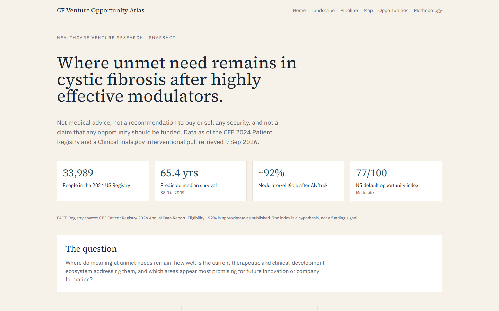
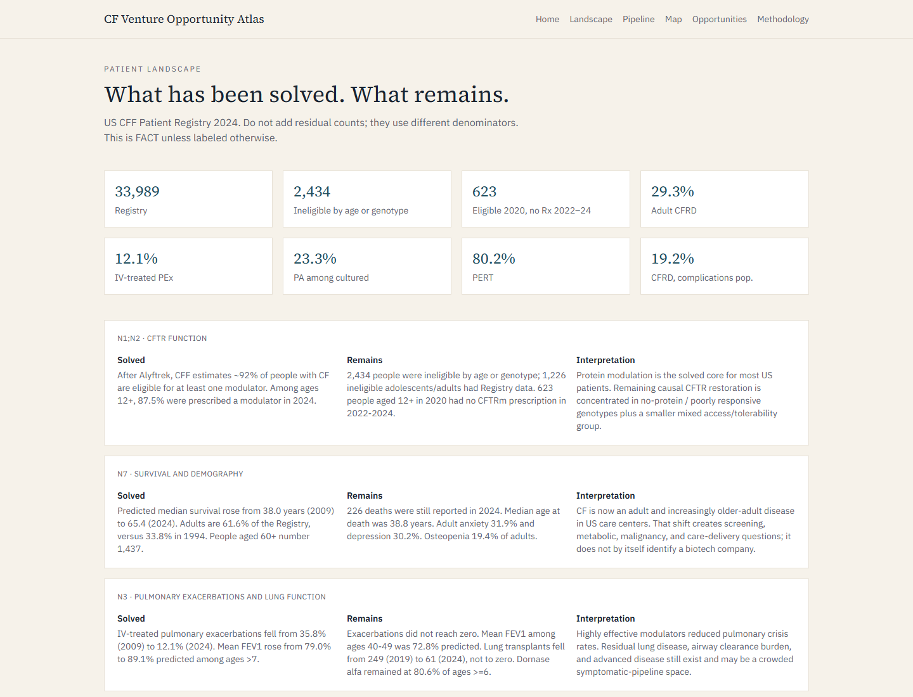
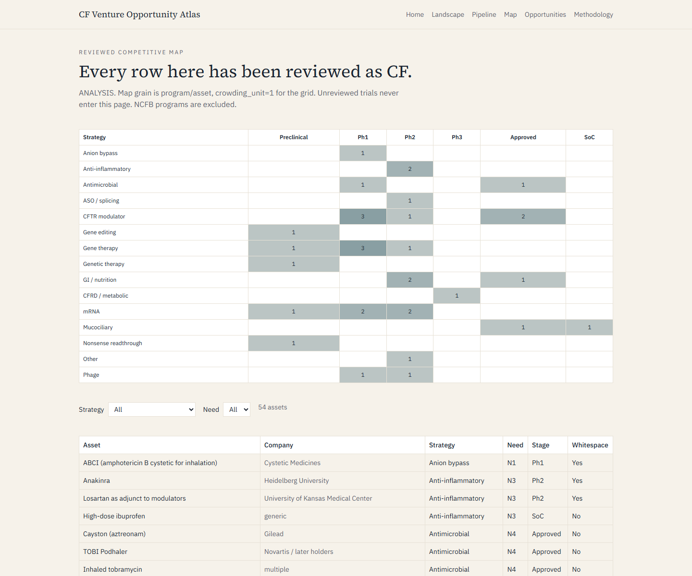
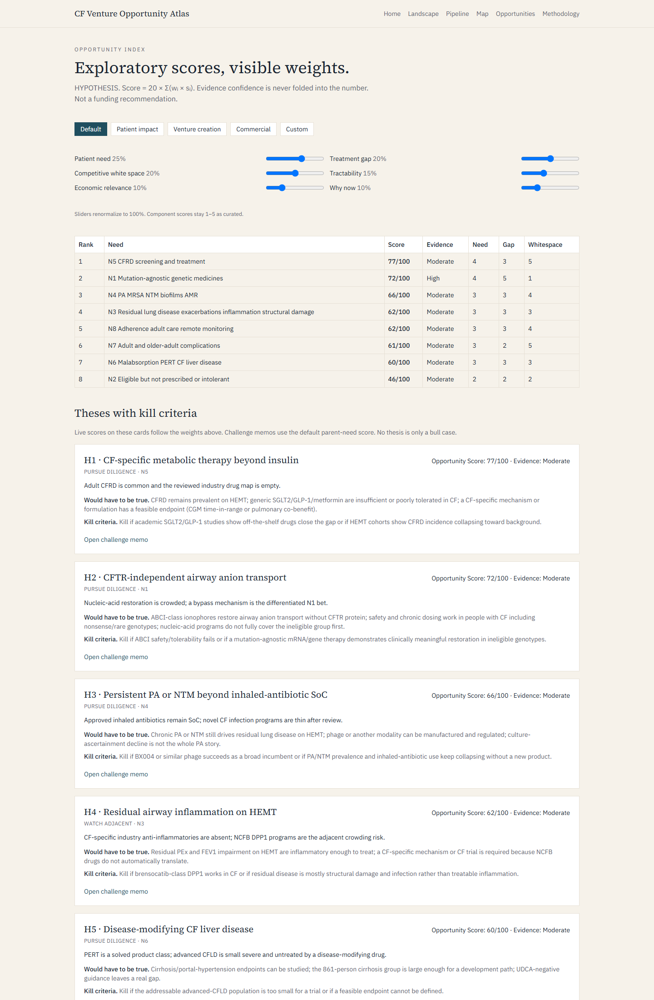
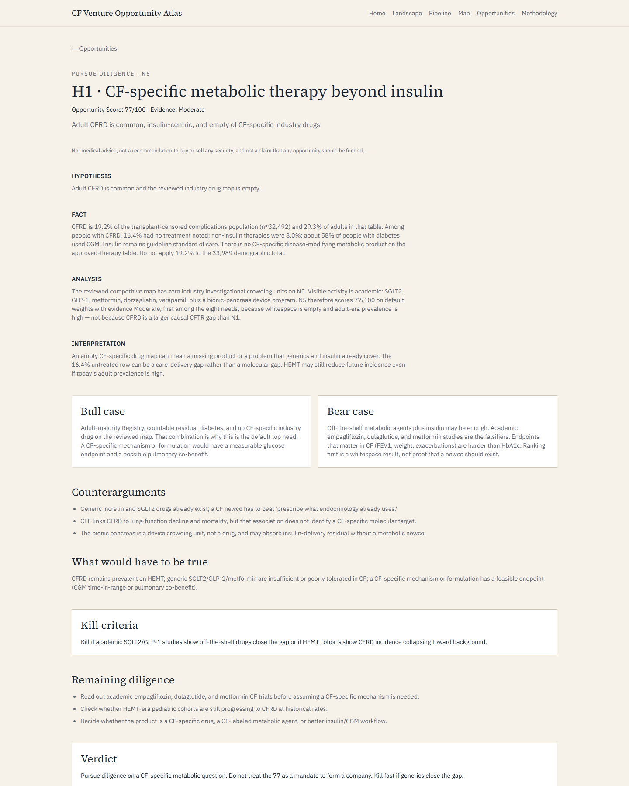

# CF Venture Opportunity Atlas

Public-data research on remaining unmet need, competitive white space, and possible company-formation opportunities in cystic fibrosis.

This is **not** medical advice, **not** a recommendation to buy or sell any security, and **not** a claim that any opportunity should be funded.

The subject of this project was selected because of a personal connection to cystic fibrosis. The analysis uses public aggregate data only and is independent of that motivation.

## Research question

Where do meaningful unmet needs remain in cystic fibrosis, how well is the current therapeutic and clinical-development ecosystem addressing them, and which areas appear most promising for future innovation or company formation?

**Read first:** [docs/executive-summary.md](docs/executive-summary.md) · **slides:** [docs/presentation/outline.md](docs/presentation/outline.md) · **theses:** [docs/theses/README.md](docs/theses/README.md)

Data as of the [CFF Patient Registry 2024 Annual Data Report](https://www.cff.org/media/38406/download) (published October 2025) and a ClinicalTrials.gov interventional pull retrieved **9 September 2026**.

## Why this matters

Highly effective CFTR modulators have changed survival, lung function, infection prevalence, and transplant volume. A large residual-need question remains: who is still left out, what disease persists on treatment, and where the pipeline is crowded versus thin.

## What the application does

Six snapshot-backed routes. No live APIs. Every major number is cited and dated.

| Route | What a reader sees |
|---|---|
| `/` | Research question, data-as-of stamp, FACT / ANALYSIS / HYPOTHESIS |
| `/landscape` | Solved vs remains from the 2024 Registry |
| `/pipeline` | 1,209 CF-tagged interventional studies, NCFB noise, starts by year |
| `/map` | Reviewed CF strategy × stage grid (54 assets). NCFB stays off. |
| `/opportunities` | Live 0–100 index, weight presets/sliders, seven theses |
| `/opportunities/H1` … `/H7` | Challenge memos with bull case, bear case, and kill criteria |
| `/methodology` | Sources, classification rule, scoring formula, limitations |

```bash
python -m cf_atlas export-app
cd app && npm install && npm run dev
```

Then open [http://localhost:3000](http://localhost:3000).

## Key findings

HYPOTHESIS unless labeled FACT. Scores are an exploratory index.

**FACT.** 33,989 people in the 2024 US Registry. Predicted median survival 65.4 years (38.0 in 2009). Adults 61.6%. After Alyftrek, CFF estimates ~92% eligible for at least one modulator. 2,434 ineligible by age or genotype. 623 eligible in 2020 with no modulator prescription 2022–24. CFRD 19.2% of the transplant-censored complications population (29.3% of adults; denominator ~32,492, not 33,989). PA 23.3% of cultured patients. IV PEx 12.1%.

**ANALYSIS.** 1,209 interventional CF-tagged studies; 98 flagged as likely non-CF bronchiectasis. Rankings and the map use only `review_status=reviewed`, `disease_area=cf`, `map_eligible=1` (54 assets). N1 has 13 industry investigational crowding units. N5 has none.

**Default ranking** (Score = 20 × Σ(wᵢ × sᵢ); evidence never folded in):

| Rank | Need | Score | Evidence |
|---|---|---|---|
| 1 | N5 CFRD / metabolic | 77 | Moderate |
| 2 | N1 mutation-agnostic restoration | 72 | High |
| 3 | N4 chronic infection | 66 | Moderate |
| 4 (tie) | N3 residual lung · N8 care delivery | 62 | Moderate |
| 6 | N7 aging | 61 | Moderate |
| 7 | N6 GI / CFLD | 60 | Moderate |
| 8 | N2 eligible not prescribed | 46 | Moderate |

N5 outranks N1 because nucleic-acid restoration is crowded, not because CFRD is a larger causal CFTR gap. Top-three membership **N5, N1, N4** is stable across four weight presets and ±10pp weight shifts. N2 stays last.

**Theses** inherit the parent need score. They are not a second index. Each has a bear case and kill criteria.

| ID | Stance | Thesis |
|---|---|---|
| H1 | pursue diligence | CF-specific metabolic therapy beyond insulin |
| H2 | pursue diligence | CFTR-independent anion transport (ABCI-class) |
| H3 | pursue diligence | Persistent PA/NTM beyond inhaled-antibiotic SoC |
| H4 | watch adjacent | Residual inflammation vs NCFB DPP1 |
| H5 | pursue diligence | Disease-modifying CFLD, not another PERT |
| H6 | services, not a drug | Adult-era treatment burden |
| H7 | watch incumbents | Nucleic-acid CFTR restoration is causal and crowded |

N2 and N7 stay in the investigation set. They are not default company-formation cards. Do not treat 33,989 people as a TAM.

## Screenshots











## Data sources

| Source | Access | Role |
|---|---|---|
| [ClinicalTrials.gov API v2](https://clinicaltrials.gov/api/v2/studies) | Programmatic, no key | Pipeline backbone (1,209 interventional) |
| [CFF Patient Registry 2024 ADR](https://www.cff.org/media/38406/download) | Public PDF | Epidemiology |
| [CFF Drug Development Pipeline](https://www.cff.org/Trials/Pipeline) | Public webpage | Preclinical + CFF-classified programs |
| FDA labels / Drugs@FDA | Manual | Approved therapies |

Details: [docs/data-sources.md](docs/data-sources.md). Custom/browser User-Agents return HTTP 403 from ClinicalTrials.gov in this environment; ingest does not override User-Agent.

## Methodology

The project separates **facts** (cited public numbers), **analysis** (counts, joins, filters), **interpretation**, and **hypotheses**. Keyword rules suggest a label for every trial. The competitive map and opportunity whitespace component use only reviewed CF map-eligible rows. See [docs/methodology.md](docs/methodology.md) and [docs/classification.md](docs/classification.md).

## Opportunity model

\[
\text{Score} = 20 \times \sum_i (w_i \times s_i)
\]

Component scores \(s_i\) are curated 1–5 rubrics. Default weights: patient need 25%, treatment gap 20%, competitive white space 20%, tractability 15%, economic 10%, why now 10%. Display as an integer `/100` plus a separate High / Moderate / Low evidence label. Economic relevance is **not** a TAM. Trial counts may inform whitespace after review; they do not set need, tractability, or why-now.

Weights live in `data/external/scoring_weights.csv`. Rubrics: [docs/scoring-rubrics.md](docs/scoring-rubrics.md).

## Architecture

```
data/raw/           immutable API dumps (jsonl is gitignored; regenerated)
data/external/      hand-curated tables with source IDs
data/processed/     tidy CSVs + atlas.sqlite (sqlite is gitignored)
src/cf_atlas/       ingest, landscape, classify, score, theses, export
app/                Next.js research interface (snapshot-backed)
docs/               methodology, executive summary, theses, slide outline
assets/screenshots/ app captures for the README
tests/              pytest
```

Every quantitative claim in curated tables traces to a `source_id`. Trial rows carry `retrieved_at`.

## Running locally

Python 3.11 or newer. Node 20 or newer for the app.

```bash
python -m venv .venv
# Windows
.venv\Scripts\activate
pip install -e ".[dev]"

python -m cf_atlas ingest-trials
python -m cf_atlas build-db
python -m cf_atlas landscape
python -m cf_atlas classify
python -m cf_atlas score
python -m cf_atlas theses
python -m cf_atlas export-app

pytest -q

cd app
npm install
npm run dev
```

`rebuild` is a shortcut for ingest + `build-db`. It hits ClinicalTrials.gov (no API key). A full interventional pull is about 1,200 studies and usually takes one to two minutes. After a clone that already has processed CSVs, `build-db` through `export-app` is enough; you do not need to re-ingest.

## Deploy the app

The interface lives in `app/` and reads a dated `snapshot.json`. It does not call live APIs.

GitHub Pages builds on every push to `main` (`.github/workflows/pages.yml`). Public site: [https://haydenbaillie.github.io/cf-venture-opportunity-atlas/](https://haydenbaillie.github.io/cf-venture-opportunity-atlas/).

To host on Vercel instead: import the repository, set **Root Directory** to `app`, framework Next.js, no environment variables.

## Limitations

US Registry aggregates are not a global patient-level file. Complication tables generally exclude lung-transplant recipients. ClinicalTrials.gov is sponsor-reported and misses most preclinical work. The CFF pipeline page includes discontinued programs; Phase 4 review marks those off the map. Falling infection and exacerbation rates are real and partly measurement-sensitive (fewer visits and cultures since 2020). See [docs/limitations.md](docs/limitations.md).

## Future research

- Split N6 scoring: PERT vs CFLD should not share one venture thesis
- HEMT-era pediatric CFRD incidence vs historical rates
- BX004 and other infection readouts before a second phage newco
- Whether residual PEx on HEMT is inflammatory, infectious, or structural
- More reviewed trials beyond the 71-row decision-critical set
- Claims or cost data only if a public, citable source exists — do not invent a TAM

## Disclaimer

This project is healthcare venture research using public aggregate data. It does not provide medical advice, does not use personal health information, and does not recommend securities. Opportunity scores are an exploratory prioritization index.
